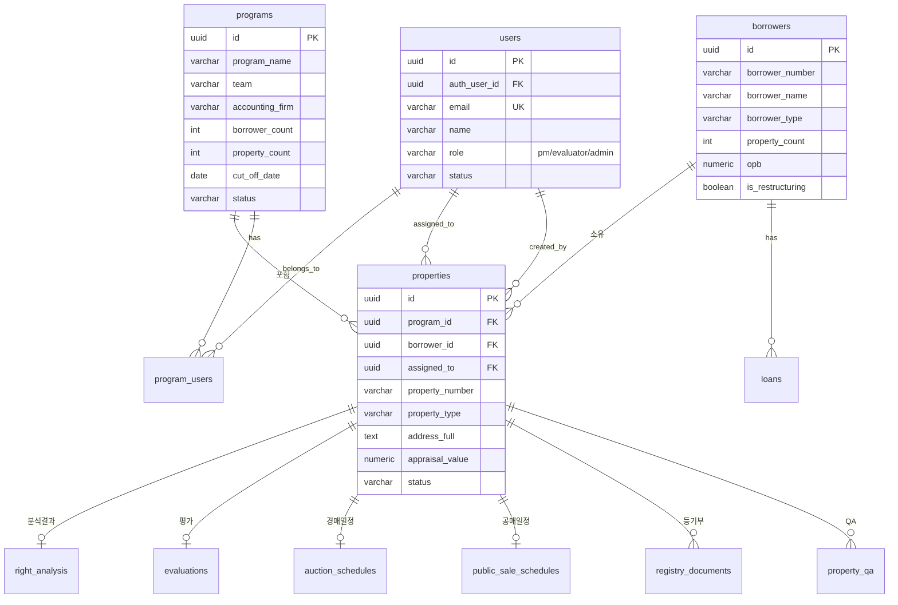
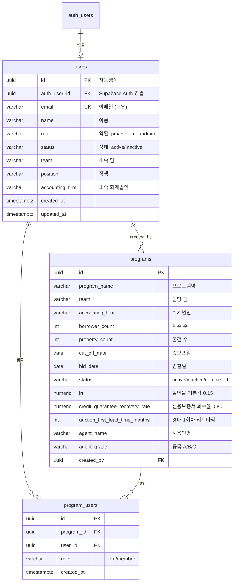
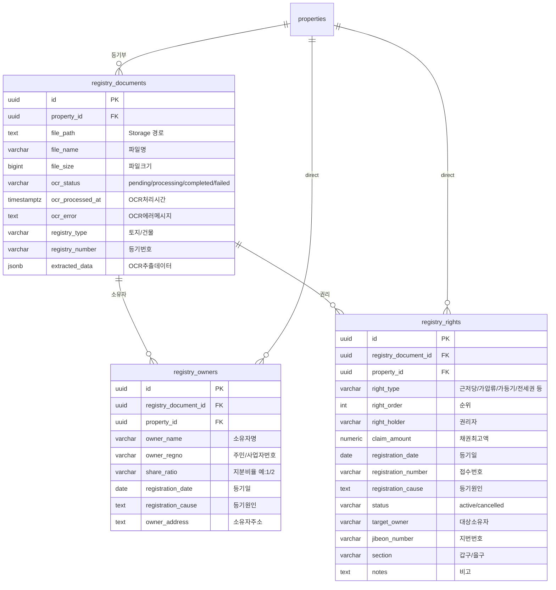
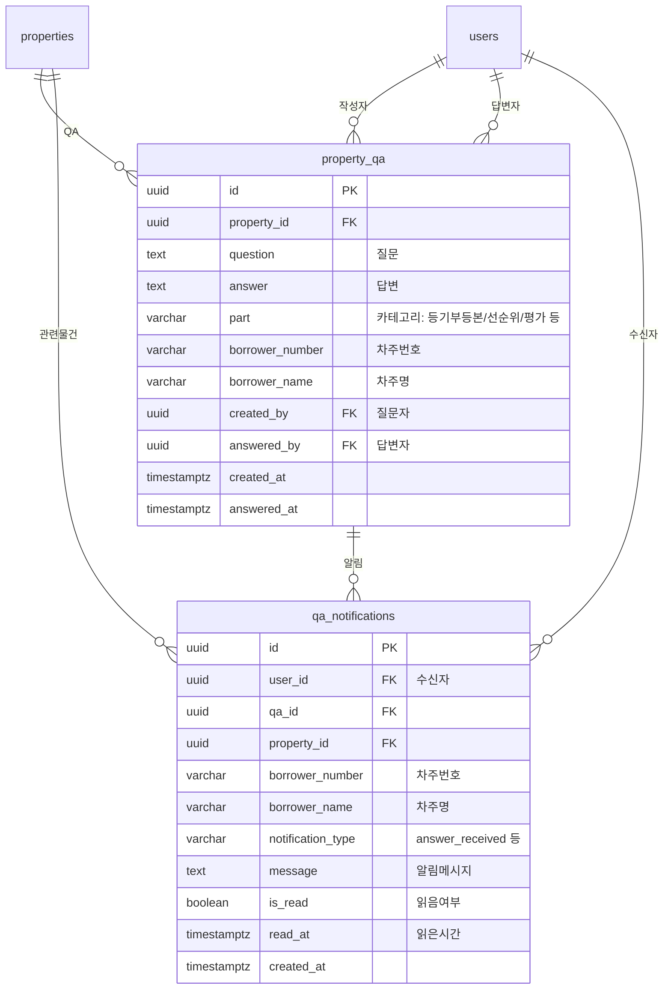

# NPLogic 데이터베이스 ERD (Entity Relationship Diagram)

> **마지막 업데이트**: 2026-01-21  
> **총 테이블 수**: 40개  
> **데이터베이스**: Supabase (PostgreSQL)

---

## 📋 목차

1. [전체 테이블 요약](#전체-테이블-요약)
2. [핵심 ERD - 물건 중심](#핵심-erd---물건-중심)
3. [사용자 및 프로그램 관리](#1-사용자-및-프로그램-관리)
4. [물건 및 차주 관리](#2-물건-및-차주-관리)
5. [등기부등본 관리](#3-등기부등본-관리)
6. [권리분석](#4-권리분석)
7. [평가 시스템](#5-평가-시스템)
8. [경매/공매 관리](#6-경매공매-관리)
9. [QA 및 알림](#7-qa-및-알림)
10. [기준정보 (마스터 데이터)](#8-기준정보-마스터-데이터)
11. [시스템 관리](#9-시스템-관리)

---

## 전체 테이블 요약

| 그룹 | 테이블명 | 설명 | 레코드 수 |
|------|----------|------|-----------|
| **사용자** | `users` | 사용자 정보 (PM/평가자/관리자) | 7 |
| **사용자** | `programs` | 프로그램(프로젝트) 정보 | 3 |
| **사용자** | `program_users` | 프로그램-사용자 매핑 | 1 |
| **물건** | `properties` | 물건 기본 정보 | 9,537 |
| **물건** | `borrowers` | 차주 정보 | 5,562 |
| **물건** | `loans` | 대출 정보 | 21,092 |
| **등기** | `registry_documents` | 등기부등본 문서 | 0 |
| **등기** | `registry_owners` | 등기부 소유자 | 6 |
| **등기** | `registry_rights` | 등기부 권리 (근저당, 가압류 등) | 43 |
| **분석** | `right_analysis` | 권리분석 결과 | 1,449 |
| **평가** | `evaluations` | 평가 정보 | 21 |
| **평가** | `evaluation_cases` | 평가 사례 (1~4) | 0 |
| **평가** | `evaluation_land_parcels` | 지번별 평가 | 0 |
| **평가** | `evaluation_machinery` | 기계기구 목록 | 0 |
| **평가** | `evaluation_rental_analysis` | 임대 분석 | 0 |
| **평가** | `evaluation_management_fees` | 선순위 관리비 | 0 |
| **평가** | `evaluation_commercial_data` | 상권정보/임대동향 | 0 |
| **경매** | `auction_schedules` | 경매 일정 | 1 |
| **경매** | `public_sale_schedules` | 공매 일정 | 1 |
| **경매** | `auction_cases` | 경매 낙찰 사례 | 10 |
| **QA** | `property_qa` | 물건 QA | 0 |
| **QA** | `qa_notifications` | QA 알림 | 0 |
| **인터림** | `interim_advances` | 인터림 선급금 | 0 |
| **인터림** | `interim_collections` | 인터림 회수 | 0 |
| **기준** | `courts` | 법원 정보 | 3 |
| **기준** | `financial_institutions` | 금융기관 | 0 |
| **기준** | `appraisal_firms` | 감정평가법인 | 0 |
| **기준** | `common_codes` | 공통코드 | 17 |
| **기준** | `lease_standards` | 임대차 기준 | 3 |
| **기준** | `legal_application_rates` | 법적 적용 비율 | 4 |
| **기준** | `auction_cost_standards` | 경매비용 기준 | 3 |
| **기준** | `public_sale_cost_standards` | 공매비용 기준 | 0 |
| **시스템** | `settings` | 시스템 설정 | 7 |
| **시스템** | `system_settings` | 시스템 설정 (신규) | 0 |
| **시스템** | `calculation_formulas` | 계산 수식 | 0 |
| **시스템** | `audit_logs` | 작업 이력 | 0 |
| **시스템** | `data_disks` | 엑셀 데이터 디스크 | 0 |
| **시스템** | `loan_info` | 대출 정보 (구) | 0 |
| **시스템** | `borrower_restructuring` | 차주 회생 정보 | 33 |
| **시스템** | `program_sheet_mappings` | 프로그램 시트 매핑 | 0 |

---

## 핵심 ERD - 물건 중심

> 💡 **핵심 개념**: `properties`(물건) 테이블이 시스템의 중심입니다. 대부분의 테이블이 물건과 연결됩니다.



---

## 1. 사용자 및 프로그램 관리

> 사용자 인증 및 프로그램(프로젝트) 관리 테이블



### 역할(Role) 설명

| 역할 | 설명 | 주요 권한 |
|------|------|----------|
| `admin` | 관리자 | 모든 데이터 조회/수정, 사용자 관리 |
| `pm` | 프로젝트 매니저 | 담당 프로그램의 모든 물건 조회/수정 |
| `evaluator` | 평가자 (회계사) | 할당된 물건만 조회/수정 |

---

## 2. 물건 및 차주 관리

> 물건(담보물건)과 차주, 대출 정보 관리

```mermaid
erDiagram
    programs ||--o{ properties : "포함"
    borrowers ||--o{ properties : "소유"
    borrowers ||--o{ loans : "대출"
    borrowers ||--o| borrower_restructuring : "회생정보"
    users ||--o{ properties : "담당자"
    
    borrowers {
        uuid id PK
        varchar borrower_number "차주번호 예:R-003"
        varchar borrower_name "차주명"
        varchar borrower_type "개인/개인사업자/법인"
        varchar business_number "사업자번호"
        int property_count "물건수"
        numeric opb "대출잔액"
        numeric mortgage_amount "근저당액"
        boolean is_restructuring "회생여부"
        boolean is_opened "경매개시여부"
        boolean is_deceased "사망여부"
        numeric xnpv_scenario1 "시나리오1 XNPV"
        numeric xnpv_scenario2 "시나리오2 XNPV"
        varchar program_id "프로그램ID"
    }
    
    properties {
        uuid id PK
        uuid program_id FK "소속 프로그램"
        uuid borrower_id FK "차주"
        varchar property_number "물건번호"
        varchar collateral_number "담보번호"
        varchar borrower_number "차주번호"
        varchar debtor_name "차주명"
        varchar property_type "물건유형"
        text address_full "전체주소"
        text address_road "도로명주소"
        numeric land_area "토지면적(㎡)"
        numeric building_area "건물면적(㎡)"
        numeric supply_area "공급면적"
        numeric appraisal_value "감정가"
        numeric minimum_bid "최저입찰가"
        numeric opb "대출잔액"
        numeric latitude "위도"
        numeric longitude "경도"
        varchar status "pending/processing/completed"
        varchar rights_analysis_status "권리분석상태"
        int rights_analysis_upload_count "권리분석 업로드 회차"
        boolean agreement_doc "약정서 제출"
        boolean guarantee_doc "보증서 제출"
        boolean auction_docs "경매열람자료 확보"
        boolean tenant_docs "전입세대열람 완료"
        boolean senior_rights_review "선순위검토 완료"
        boolean appraisal_confirmed "평가액확정"
        boolean interim_completed "인터림완료"
        boolean owner_move_in "소유주전입"
        date auction_schedule_date "경매일정"
        int qa_unanswered_count "미회신QA수"
        uuid assigned_to FK "담당자"
        uuid created_by FK "생성자"
    }
    
    loans {
        uuid id PK
        uuid borrower_id FK
        varchar account_serial "계좌일련번호"
        varchar loan_type "대출유형"
        varchar loan_category "대출분류"
        varchar account_number "계좌번호"
        numeric initial_loan_amount "최초대출금"
        numeric loan_principal_balance "대출원금잔액"
        numeric advance_payment "선급금"
        numeric accrued_interest "미수이자"
        numeric total_claim_amount "총채권액"
        date initial_loan_date "최초대출일"
        date last_interest_date "최종이자일"
        numeric normal_interest_rate "정상이자율"
        numeric overdue_interest_rate "연체이자율"
        uuid collateral_1_id "담보물건1"
        uuid collateral_2_id "담보물건2"
        uuid collateral_3_id "담보물건3"
        boolean has_agreement_doc "약정서유무"
        boolean has_valid_guarantee "유효보증유무"
        numeric principal_offset "원금상계"
        numeric interest_offset "이자상계"
    }
    
    borrower_restructuring {
        uuid id PK
        uuid borrower_id FK UK
        varchar approval_status "인가/미인가"
        varchar progress_stage "진행단계"
        varchar court_name "관할법원"
        varchar case_number "회생사건번호"
        date filing_date "회생신청일"
        date commencement_date "개시결정일"
        date claim_filing_date "채권신고일"
        date approval_dismissal_date "인가/폐지결정일"
        varchar excluded_claim "회생탈락권"
    }
```

---

## 3. 등기부등본 관리

> OCR로 추출한 등기부등본 정보 관리



### 권리 유형(right_type) 종류

| 유형 | 설명 | 배당 영향 |
|------|------|----------|
| `근저당` | 근저당권 | 채권최고액 기준 배당 |
| `가압류` | 가압류 | 청구금액 기준 |
| `가등기` | 가등기 | 소유권 이전 위험 |
| `전세권` | 전세권 | 대항력 있으면 선순위 |
| `지상권` | 지상권 | 토지 이용 제한 |
| `임차권` | 임차권 | 대항력 확인 필요 |

---

## 4. 권리분석

> 물건별 권리분석 결과 저장 (선순위 계산, 배당 시뮬레이션)

```mermaid
erDiagram
    properties ||--o| right_analysis : "분석"
    users ||--o{ right_analysis : "분석자"
    
    right_analysis {
        uuid id PK
        uuid property_id FK
        varchar auction_status "경매상태: opened/not_opened"
        boolean precedent_auction "선행경매여부"
        boolean subsequent_auction "후행경매여부"
        varchar court_name "법원명"
        varchar case_number "사건번호"
        varchar auction_applicant "경매신청인"
        date auction_start_date "경매개시일"
        date claim_deadline_date "채권신고기한"
        numeric claim_amount "청구금액"
        numeric initial_appraisal_value "감정가"
        date initial_auction_date "최초경매일"
        int final_auction_round "최종경매회차"
        date final_auction_date "최종경매일"
        varchar final_auction_result "최종경매결과"
        numeric winning_bid_amount "낙찰가"
        date next_auction_date "다음경매일"
        numeric next_minimum_bid "다음최저가"
        boolean claim_deadline_passed "채권신고기한경과"
        boolean address_match "주소일치여부"
        boolean owner_registered "소유자등기여부"
        varchar tenant_name "임차인명"
        date tenant_move_in_date "임차인전입일"
        numeric housing_official_price "주택공시가격"
        boolean has_auction_docs "경매자료확보"
        boolean has_tenant_registry "전입세대확인"
        boolean has_commercial_lease "상가임대차확인"
        boolean has_tenant "임차인유무"
        boolean tenant_claim_submitted "임차인배당요구"
        boolean tenant_date_before_mortgage "임차인선순위여부"
        varchar debtor_type "채무자유형: individual/business/corporation"
        boolean has_wage_claim "임금채권유무"
        boolean has_tax_claim "당해세유무"
        boolean has_senior_tax_claim "선순위조세유무"
    }

    right_analysis {
        numeric senior_mortgage_dd "선순위근저당 DD금액"
        numeric senior_mortgage_reflected "선순위근저당 반영금액"
        text senior_mortgage_reason "선순위근저당 근거"
        numeric lien_dd "유치권 DD금액"
        numeric lien_reflected "유치권 반영금액"
        text lien_reason "유치권 근거"
        numeric small_deposit_dd "소액보증금 DD금액"
        numeric small_deposit_reflected "소액보증금 반영금액"
        text small_deposit_reason "소액보증금 근거"
        varchar small_deposit_case "소액보증금 판단케이스"
        numeric lease_deposit_dd "임대보증금 DD금액"
        numeric lease_deposit_reflected "임대보증금 반영금액"
        text lease_deposit_reason "임대보증금 근거"
        numeric wage_claim_dd "임금채권 DD금액"
        numeric wage_claim_reflected "임금채권 반영금액"
        text wage_claim_reason "임금채권 근거"
        numeric current_tax_dd "당해세 DD금액"
        numeric current_tax_reflected "당해세 반영금액"
        text current_tax_reason "당해세 근거"
        numeric senior_tax_dd "선순위조세 DD금액"
        numeric senior_tax_reflected "선순위조세 반영금액"
        text senior_tax_reason "선순위조세 근거"
        numeric etc_dd "기타 DD금액"
        numeric etc_reflected "기타 반영금액"
        text etc_reason "기타 근거"
        numeric senior_total_dd "선순위합계 DD금액"
    }

    right_analysis {
        numeric expected_winning_bid "예상낙찰가"
        numeric auction_fees "경매비용"
        numeric distributable_amount "배분가능액"
        numeric amount_after_senior "선순위공제후금액"
        numeric loan_cap "대출한도"
        numeric cap_applied_dividend "한도적용배당액"
        numeric recovery_amount "회수예상액"
        numeric recovery_rate "회수율"
        varchar risk_level "위험등급: high/medium/low"
        text risk_reason "위험사유"
        text recommendations "권리분석의견"
        uuid analyzed_by FK "분석자"
        timestamptz analyzed_at "분석일시"
        boolean is_completed "분석완료여부"
        date appraisal_date "감정평가일"
        numeric appraisal_value "감정평가액"
        varchar appraisal_type "감정평가구분"
        varchar appraisal_agency "감정평가기관"
        numeric minimum_bid "최저입찰가"
        int auction_count "경매회차"
    }
```



---

## 5. 평가 시스템

> 물건별 평가 정보 및 사례, 상세 분석 데이터

```mermaid
erDiagram
    properties ||--o| evaluations : "평가"
    users ||--o{ evaluations : "평가자"
    evaluations ||--o{ evaluation_cases : "사례"
    evaluations ||--o{ evaluation_land_parcels : "지번별"
    evaluations ||--o{ evaluation_machinery : "기계기구"
    evaluations ||--o{ evaluation_rental_analysis : "임대분석"
    evaluations ||--o| evaluation_management_fees : "관리비"
    evaluations ||--o| evaluation_commercial_data : "상권정보"
    
    evaluations {
        uuid id PK
        uuid property_id FK
        varchar evaluation_type "평가유형"
        numeric market_value "시세"
        numeric evaluated_value "평가액"
        numeric recovery_rate "회수율"
        jsonb evaluation_details "평가상세 JSON"
        uuid evaluated_by FK
        timestamptz evaluated_at
    }
    
    evaluation_cases {
        uuid id PK
        uuid evaluation_id FK
        int case_number "사례번호 1~4"
        varchar case_type "사례유형"
        varchar auction_case_no "경매사건번호"
        date winning_date "낙찰일"
        varchar usage "용도"
        text address "주소"
        numeric land_area_pyeong "토지면적(평)"
        numeric building_area_pyeong "건물면적(평)"
        date preservation_date "보존등기일"
        date use_approval_date "사용승인일"
        numeric legal_price "법정가"
        numeric land_price "토지가"
        numeric building_price "건물가"
        date appraisal_date "감정일"
        numeric land_unit_appraisal "토지단가(감정)"
        numeric building_unit_appraisal "건물단가(감정)"
        numeric winning_price "낙찰가"
        numeric winning_rate "낙찰률"
        int winning_round "낙찰회차"
        numeric latitude "위도"
        numeric longitude "경도"
    }
    
    evaluation_land_parcels {
        uuid id PK
        uuid evaluation_id FK
        varchar parcel_number "지번번호"
        varchar parcel_type "토지/건물/기계기구"
        text address "주소"
        numeric area_pyeong "면적(평)"
        numeric unit_appraisal "단가(감정)"
        numeric appraisal_value "감정가"
        numeric scenario1_unit_price "시나리오1 단가"
        numeric scenario1_value "시나리오1 가액"
        numeric scenario2_unit_price "시나리오2 단가"
        numeric scenario2_value "시나리오2 가액"
        int sort_order "정렬순서"
    }
    
    evaluation_machinery {
        uuid id PK
        uuid evaluation_id FK
        int item_number "품목번호"
        varchar machinery_name "기계명"
        varchar manufacturer "제조사"
        date manufacture_date "제조일"
        int quantity "수량"
        numeric unit_price "단가"
        numeric appraisal_value "감정가"
        boolean factory_mortgage_1 "공장저당1"
        boolean factory_mortgage_2 "공장저당2"
        numeric recognition_rate "인정률 기본0.2"
    }
    
    evaluation_rental_analysis {
        uuid id PK
        uuid evaluation_id FK
        varchar analysis_type "분석유형"
        int quote_number "호가번호"
        numeric supply_area_pyeong "공급면적(평)"
        numeric exclusive_area_pyeong "전용면적(평)"
        numeric deposit "보증금"
        numeric monthly_rent "월세"
        numeric unit_rent "단위임료"
        varchar floor "층"
        varchar tenant_name "임차인"
        date lease_start_date "임대시작일"
        date lease_end_date "임대종료일"
        numeric annual_rent "연임료"
        int free_rent_months "프리렌트기간"
    }
    
    evaluation_management_fees {
        uuid id PK
        uuid evaluation_id FK UK
        varchar management_office_phone "관리사무소연락처"
        numeric arrears_fee "체납관리비"
        numeric monthly_fee "월관리비"
        numeric scenario1_estimated_fee "시나리오1 예상관리비"
        numeric scenario2_estimated_fee "시나리오2 예상관리비"
    }
    
    evaluation_commercial_data {
        uuid id PK
        uuid evaluation_id FK UK
        varchar commercial_type "상권유형"
        jsonb rental_yield "임대수익률"
        jsonb rental_price_index "임대가격지수"
        jsonb vacancy_rate "공실률"
        jsonb rental_price "임대료"
        jsonb floor_efficiency "층별효용"
        numeric base_discount_rate "기준할인율 0.06"
        numeric sensitivity_basis "민감도기준 0.005"
        numeric income_value "수익가치"
        numeric unit_income_value "단위수익가치"
    }
```

---

## 6. 경매/공매 관리

> 경매 및 공매 일정, 비용 계산, 시나리오별 분석

```mermaid
erDiagram
    properties ||--o| auction_schedules : "경매"
    properties ||--o| public_sale_schedules : "공매"
    
    auction_schedules {
        uuid id PK
        uuid property_id FK
        varchar auction_number "경매차수"
        date auction_date "경매일"
        date bid_date "입찰일"
        numeric minimum_bid "최저입찰가"
        numeric sale_price "낙찰가"
        varchar status "scheduled/completed/cancelled"
        varchar schedule_type "auction/public_sale"
        varchar auction_request_type "*1=예정/*2=결정/*3=3자/*4=중복"
        varchar jurisdiction_court "관할법원"
        numeric court_discount_rate "법원저감율"
        boolean is_borrower_deceased "차주사망여부"
        boolean is_owner_moved_in "소유주전입여부"
        boolean is_session_opened "개회여부"
        varchar loan_type "대출유형"
        boolean has_subrogation_registration "대위등기여부"
        varchar subrogation_entity "대위등기기관"
        numeric subrogation_cost "대위등기비용"
        boolean is_housing_mortgage_loan "주담대여부"
        date final_completion_date "최종완료예정일"
    }

    auction_schedules {
        text case_capture_url "사건내역 캡처URL"
        text schedule_capture_url "기일내역 캡처URL"
        text document_capture_url "문건송달 캡처URL"
        numeric land_appraisal_value "토지감정가"
        numeric building_appraisal_value "건물감정가"
        numeric machinery_appraisal_value "기계감정가"
        numeric other_bank_senior_value "타행선순위"
        numeric scenario1_winning_bid "시나리오1 낙찰가"
        numeric scenario2_winning_bid "시나리오2 낙찰가"
        text scenario1_eval_reason "시나리오1 평가근거"
        text scenario2_eval_reason "시나리오2 평가근거"
        date scenario1_auction_request_date "시나리오1 경매신청일"
        date scenario2_auction_request_date "시나리오2 경매신청일"
        int scenario1_procedure_months "시나리오1 절차기간"
        int scenario2_procedure_months "시나리오2 절차기간"
        numeric scenario1_legal_price "시나리오1 법정가"
        numeric scenario2_legal_price "시나리오2 법정가"
        int scenario1_expected_round "시나리오1 예상회차"
        int scenario2_expected_round "시나리오2 예상회차"
    }

    auction_schedules {
        numeric newspaper_ad_fee "신문공고비 기본220000"
        numeric survey_fee "조사비 기본70000"
        numeric auction_sale_fee "매각수수료"
        numeric appraisal_fee "감정료"
        numeric delivery_fee "송달료"
        numeric registration_education_fee "등록면허세"
        numeric other_cost "기타비용 기본5000"
        numeric additional_cost_rate "추가비용율 기본0.10"
        int property_count "물건수 기본1"
        int creditor_count "채권자수 기본1"
        numeric scenario1_senior_deduction "시나리오1 선순위공제"
        numeric scenario2_senior_deduction "시나리오2 선순위공제"
        numeric scenario1_auction_fees "시나리오1 경매비용"
        numeric scenario2_auction_fees "시나리오2 경매비용"
        numeric scenario1_distributable_after_sale "시나리오1 낙찰후배분가능액"
        numeric scenario2_distributable_after_sale "시나리오2 낙찰후배분가능액"
        numeric scenario1_loan_cap "시나리오1 대출한도1"
        numeric scenario2_loan_cap "시나리오2 대출한도1"
        numeric scenario1_cap_applied_dividend "시나리오1 한도적용배당"
        numeric scenario2_cap_applied_dividend "시나리오2 한도적용배당"
        numeric actual_paid_deposit "실납예납금"
        numeric deposit_recovery_rate "예납금회수율 기본0.90"
    }

    public_sale_schedules {
        uuid id PK
        uuid property_id FK
        varchar sale_number "공매번호"
        date sale_date "공매일"
        numeric minimum_bid "최저입찰가"
        numeric sale_price "매각가"
        varchar status "상태"
        numeric total_appraisal_value "총감정가"
        numeric land_appraisal_value "토지감정가"
        numeric building_appraisal_value "건물감정가"
        numeric machinery_appraisal_value "기계감정가"
        numeric other_bank_senior_value "타행선순위"
        numeric initial_appraisal_value "최초감정가"
        date scenario1_start_date "시나리오1 시작일"
        date scenario2_start_date "시나리오2 시작일"
        numeric scenario1_winning_bid "시나리오1 낙찰가"
        numeric scenario2_winning_bid "시나리오2 낙찰가"
        numeric scenario1_beneficiary_change_cost "시나리오1 수익자변경비용"
        numeric scenario2_beneficiary_change_cost "시나리오2 수익자변경비용"
        numeric onbid_fee "온비드수수료"
        numeric appraisal_fee "감정료"
        numeric total_sale_cost "총공매비용"
        int lead_time_days "리드타임 기본11일"
        numeric discount_rate "저감율 기본0.10"
        jsonb creditor_distributions "타채권자배분정보"
    }
    
    auction_cases {
        uuid id PK
        varchar case_no UK "사건번호"
        varchar auctionone_court "법원"
        varchar auctionone_area "지역"
        varchar usage "용도"
        int object_group "물건그룹 1~5"
        text address "주소"
        text address_road "도로명주소"
        varchar region_big "시도"
        varchar region_mid "시군구"
        varchar region_small "읍면동"
        numeric latitude "위도"
        numeric longitude "경도"
        date auction_date "경매일"
        int big_round "대회차"
        numeric appraisal_price "감정가"
        numeric building_appraisal_price "건물감정가"
        numeric land_appraisal_price "토지감정가"
        numeric winning_price "낙찰가"
        numeric second_big_price "차순위가"
        numeric building_area "건물면적"
        numeric land_area "토지면적"
        numeric building_unit_price "건물단가"
        numeric land_unit_price "토지단가"
        int auction_days "낙찰일(경과일)"
        date valuation_base_date "평가기준일"
        date new_build_date "신축일"
        date use_approval_date "사용승인일"
        text popup_url "팝업URL"
    }
```



---

## 7. QA 및 알림

> 물건별 질의응답 및 알림 관리



---

## 8. 기준정보 (마스터 데이터)

> 시스템 전반에서 사용하는 기준 데이터

```mermaid
erDiagram
    courts {
        uuid id PK
        varchar court_code UK "법원코드"
        varchar court_name "법원명"
        varchar region "지역"
        text address "주소"
        varchar phone "연락처"
        numeric discount_rate_1 "저감율1"
        numeric discount_rate_2 "저감율2"
        numeric discount_rate_3 "저감율3"
        numeric discount_rate_4 "저감율4"
        boolean is_active "사용여부"
    }
    
    financial_institutions {
        uuid id PK
        varchar institution_code UK "기관코드"
        varchar institution_name "기관명"
        varchar institution_type "기관유형"
        text address "주소"
        varchar phone "연락처"
        varchar swift_code "SWIFT코드"
        boolean is_active "사용여부"
    }
    
    appraisal_firms {
        uuid id PK
        varchar firm_code UK "법인코드"
        varchar firm_name "법인명"
        varchar representative "대표자"
        text address "주소"
        varchar phone "연락처"
        varchar email "이메일"
        varchar license_number "면허번호"
        boolean is_active "사용여부"
    }
    
    common_codes {
        uuid id PK
        varchar code_group "코드그룹"
        varchar code_value "코드값"
        varchar code_name "코드명"
        int sort_order "정렬순서"
        text description "설명"
        boolean is_active "사용여부"
    }
    
    lease_standards {
        uuid id PK
        text lease_type "임대유형: residential 등"
        text region "지역"
        date start_date "시작일"
        date end_date "종료일"
        numeric deposit_limit "보증금한도"
        numeric compensation_amount "변제금액"
        text description "설명"
        boolean is_active "사용여부"
    }
    
    legal_application_rates {
        uuid id PK
        text property_type "물건유형"
        numeric applied_rate "적용비율"
        text description "설명"
        boolean is_active "사용여부"
    }
    
    auction_cost_standards {
        uuid id PK
        text cost_type "비용유형"
        text calculation_method "계산방법"
        numeric base_amount "기준금액"
        numeric rate "비율"
        text description "설명"
        boolean is_active "사용여부"
    }
    
    public_sale_cost_standards {
        uuid id PK
        text cost_type "비용유형"
        text calculation_method "계산방법"
        numeric base_amount "기준금액"
        numeric rate "비율"
        text description "설명"
        boolean is_active "사용여부"
    }
```



---

## 9. 시스템 관리

> 설정, 로그, 인터림 관리 등 시스템 운영 테이블

```mermaid
erDiagram
    programs ||--o{ interim_advances : "선급금"
    programs ||--o{ interim_collections : "회수"
    programs ||--o{ program_sheet_mappings : "시트매핑"
    users ||--o{ program_sheet_mappings : "업로더"
    users ||--o{ audit_logs : "작업자"
    
    settings {
        uuid id PK
        varchar setting_key UK "설정키"
        jsonb setting_value "설정값 JSON"
        varchar setting_type "설정유형"
        text description "설명"
    }
    
    system_settings {
        uuid id PK
        varchar setting_key UK "설정키"
        text setting_value "설정값"
        varchar setting_type "STRING 등"
        text description "설명"
    }
    
    calculation_formulas {
        uuid id PK
        varchar formula_name UK "수식명"
        text formula_expression "수식표현"
        text formula_description "수식설명"
        varchar applies_to "적용대상"
        boolean is_active "사용여부"
    }
    
    audit_logs {
        uuid id PK
        varchar table_name "대상테이블"
        uuid record_id "대상레코드ID"
        varchar action "INSERT/UPDATE/DELETE"
        jsonb old_data "변경전데이터"
        jsonb new_data "변경후데이터"
        uuid user_id FK "작업자"
        varchar user_email "작업자이메일"
        varchar ip_address "IP주소"
        text user_agent "UserAgent"
        timestamptz created_at "작업시간"
    }
    
    interim_advances {
        uuid id PK
        uuid program_id FK
        varchar borrower_number "차주번호"
        varchar borrower_name "차주명"
        varchar pool "풀"
        varchar loan_type "대출유형"
        varchar account_serial "계좌일련번호"
        varchar account_number "계좌번호"
        varchar expense_type "비용유형"
        date transaction_date "거래일"
        varchar currency "통화 기본KRW"
        numeric amount "금액"
        text description "설명"
        text notes "비고"
        uuid uploaded_by FK
    }
    
    interim_collections {
        uuid id PK
        uuid program_id FK
        varchar borrower_number "차주번호"
        varchar borrower_name "차주명"
        varchar pool "풀"
        varchar loan_type "대출유형"
        varchar account_serial "계좌일련번호"
        varchar account_number "계좌번호"
        date collection_date "회수일"
        numeric principal_amount "원금"
        numeric advance_amount "선급금"
        numeric interest_amount "이자"
        numeric total_amount "총액"
        text notes "비고"
        uuid uploaded_by FK
    }
    
    program_sheet_mappings {
        uuid id PK
        uuid program_id FK
        varchar sheet_type "시트타입: SheetA/SheetB 등"
        varchar sheet_type_display "시트타입 표시명"
        varchar excel_sheet_name "엑셀시트명"
        jsonb column_mappings "컬럼매핑 JSON"
        int row_count "행수"
        varchar file_name "파일명"
        timestamptz uploaded_at "업로드시간"
        uuid uploaded_by FK
    }
    
    data_disks {
        uuid id PK
        uuid property_id FK
        varchar debtor_name "차주명"
        varchar debtor_regno "주민/사업자번호"
        varchar debt_type "채무유형"
        numeric principal_amount "원금"
        numeric interest_rate "이자율"
        numeric overdue_interest_rate "연체이자율"
        varchar sale_type "경매/공매"
        varchar court_name "법원명"
        varchar case_number "사건번호"
        jsonb data_json "추가데이터 JSON"
    }
    
    loan_info {
        uuid id PK
        uuid property_id FK
        varchar loan_type "대출유형"
        numeric loan_amount "대출금액"
        numeric interest_rate "이자율"
        varchar guarantee_type "보증유형"
        numeric guarantee_amount "보증금액"
        jsonb loan_details "대출상세 JSON"
    }
```



---

## 📌 주요 Foreign Key 관계 요약

| 소스 테이블 | FK 컬럼 | 참조 테이블 | 설명 |
|------------|---------|------------|------|
| `properties` | `program_id` | `programs` | 물건이 속한 프로그램 |
| `properties` | `borrower_id` | `borrowers` | 물건 소유 차주 |
| `properties` | `assigned_to` | `users` | 담당자 |
| `properties` | `created_by` | `users` | 생성자 |
| `loans` | `borrower_id` | `borrowers` | 대출의 차주 |
| `right_analysis` | `property_id` | `properties` | 권리분석 대상 물건 |
| `evaluations` | `property_id` | `properties` | 평가 대상 물건 |
| `auction_schedules` | `property_id` | `properties` | 경매 대상 물건 |
| `registry_documents` | `property_id` | `properties` | 등기부 대상 물건 |
| `registry_rights` | `registry_document_id` | `registry_documents` | 권리의 출처 문서 |
| `evaluation_cases` | `evaluation_id` | `evaluations` | 평가의 사례 |
| `program_users` | `program_id` | `programs` | 프로그램 매핑 |
| `program_users` | `user_id` | `users` | 사용자 매핑 |

---

## 💡 용어 설명 (주니어 개발자용)

| 용어 | 설명 |
|------|------|
| **PK** | Primary Key (기본키) - 테이블에서 각 행을 고유하게 식별 |
| **FK** | Foreign Key (외래키) - 다른 테이블의 PK를 참조 |
| **UK** | Unique Key (고유키) - 중복 불가 |
| **UUID** | 범용 고유 식별자 (예: `550e8400-e29b-41d4-a716-446655440000`) |
| **JSONB** | PostgreSQL의 바이너리 JSON 타입 (유연한 데이터 저장) |
| **RLS** | Row Level Security - 행 단위 접근 제어 |
| **차주** | 대출을 받은 사람/회사 (Borrower) |
| **담보물건** | 대출 담보로 잡힌 부동산 (Property/Collateral) |
| **경매** | 법원 경매 (Auction) |
| **공매** | 한국자산관리공사(KAMCO) 공매 (Public Sale) |
| **선순위** | 배당 시 먼저 받을 권리가 있는 채권 |
| **DD** | Due Diligence - 실사 금액 |
| **XNPV** | 불규칙 현금흐름의 순현재가치 |

---

**문서 작성일**: 2026-01-21  
**작성자**: NPLogic 개발팀
