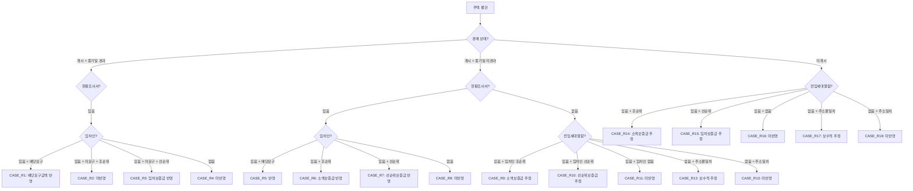

# NPLogic 비즈니스 로직 문서

> **마지막 업데이트**: 2026-01-21  
> **대상**: 주니어 개발자 / 신규 인수인계 팀  
> **핵심 파일**: `RightAnalysisRuleEngine.cs`, `XnpvCalculator.cs`

---

## 📋 목차

1. [개요](#개요)
2. [권리분석 룰 엔진](#1-권리분석-룰-엔진)
3. [선순위 계산 로직](#2-선순위-계산-로직)
4. [XNPV 계산](#3-xnpv-계산)
5. [경매/공매 시나리오](#4-경매공매-시나리오)
6. [배당 시뮬레이션](#5-배당-시뮬레이션)
7. [엑셀 수식 매핑](#6-엑셀-수식-매핑)
8. [용어 사전](#7-용어-사전)

---

## 개요

### NPLogic이 해결하는 문제

NPLogic은 **NPL(Non-Performing Loan, 부실채권)** 평가를 자동화하는 시스템입니다.

```
┌─────────────────┐
│  데이터디스크    │  ← 은행에서 제공하는 엑셀 파일
│  (Excel)        │     (차주 정보, 대출 정보, 담보 정보)
└────────┬────────┘
         │
         ▼
┌─────────────────┐
│   권리분석       │  ← 선순위 판단, 배당 시뮬레이션
│   (RuleEngine)  │
└────────┬────────┘
         │
         ▼
┌─────────────────┐
│   평가/회수율    │  ← 시나리오별 낙찰가 예측
│   계산           │     XNPV, IRR 계산
└────────┬────────┘
         │
         ▼
┌─────────────────┐
│   결과 보고서    │  ← 비핵심 전체 양식 출력
│   (Excel)       │
└─────────────────┘
```

### 핵심 비즈니스 로직

| 영역 | 클래스 | 역할 |
|------|--------|------|
| **권리분석** | `RightAnalysisRuleEngine` | 40+ 케이스 룰 기반 선순위 판단 |
| **XNPV 계산** | `XnpvCalculator` | 현금흐름 순현재가치 계산 |
| **배당 계산** | ViewModel 내 로직 | 경매/공매 배당 시뮬레이션 |

---

## 1. 권리분석 룰 엔진

### 1.1 개요

`RightAnalysisRuleEngine`은 물건의 권리 상태를 분석하여 **선순위 채권**을 판단합니다.

```
📍 위치: src/NPLogic.Core/Services/RightAnalysisRuleEngine.cs
```

### 1.2 판단 순서

```csharp
public void ApplyRules(RightAnalysis analysis, Property? property)
{
    // 1. 물건 유형 결정 (주택/토지/상가)
    var propertyType = DeterminePropertyType(property);

    // 2. 선순위 근저당권 판단
    ApplySeniorMortgageRules(analysis);

    // 3. 유치권 판단
    ApplyLienRules(analysis);

    // 4. 선순위 소액보증금/임차보증금 판단 (40+ 케이스)
    ApplyDepositRules(analysis, propertyType);

    // 5. 선순위 임금채권 판단
    ApplyWageClaimRules(analysis);

    // 6. 당해세 및 선순위 조세채권 판단
    ApplyTaxRules(analysis);
}
```

### 1.3 물건 유형 분류

| 유형 | 코드 | 포함 물건 |
|------|------|----------|
| **주택** | `Residential` | 아파트, 빌라, 다세대, 다가구, 단독주택 |
| **토지** | `Land` | 대지, 임야, 농지 등 |
| **상가/공장** | `Commercial` | 상가, 공장, 사무실, 창고 |

```csharp
private PropertyCategory DeterminePropertyType(Property? property)
{
    var type = property?.PropertyType?.ToLower() ?? "";

    if (type.Contains("토지") || type.Contains("land"))
        return PropertyCategory.Land;

    if (type.Contains("상가") || type.Contains("공장"))
        return PropertyCategory.Commercial;

    return PropertyCategory.Residential;  // 기본값: 주택
}
```

### 1.4 케이스 판단 흐름도

#### 주택 물건 케이스 (CASE_R1 ~ CASE_R18)



### 1.5 케이스별 상세

#### 경매개시 + 배당요구종기일 경과 (CASE_R1 ~ R4)

| 케이스 | 조건 | 결과 | 근거 문구 |
|--------|------|------|----------|
| **R1** | 현황조사서O + 임차인O + 배당요구O | DD금액 반영 | "배당요구종기일 경과 물건으로 현황조사서상 임차인 확인되며 경매열람자료상 임차인 배당요구신청금액 확인반영함." |
| **R2** | 현황조사서O + 임차인O + 배당요구X + 후순위 | 미반영 | "배당요구종기일 경과 물건으로 현황조사서상 임차인 확인되며 임차인 배당요구신청 없어 미반영함." |
| **R3** | 현황조사서O + 임차인O + 배당요구X + 선순위 | 임차보증금 반영 | "임차일 고려하여 선순위 임차보증금 반영함." |
| **R4** | 현황조사서O + 임차인X | 미반영 | "배당요구종기일 경과 물건으로 제시된 경매열람자료 현황조사서상 임차인 없어 미반영함." |

#### 토지 물건 케이스 (CASE_L1 ~ L4)

| 케이스 | 조건 | 결과 |
|--------|------|------|
| **L1** | 개시 + 종기일경과 + 현황조사서O | 미반영 (토지이므로 임차인 없음) |
| **L2** | 개시 + 종기일미경과 + 현황조사서O | 미반영 |
| **L3** | 개시 + 종기일미경과 + 현황조사서X | 미반영 |
| **L4** | 미개시 | 미반영 |

#### 상가/공장 케이스 (CASE_C1 ~ C15)

주택과 유사하나 **상가임대차열람서**를 기준으로 판단합니다.

### 1.6 소액보증금 추정 로직

경매개시 미개시 또는 전입세대열람 없을 때 보수적 추정:

```csharp
private decimal EstimateSmallDeposit(decimal? housingOfficialPrice)
{
    // 2024년 기준 소액임차인 최우선변제금
    if (housingOfficialPrice.HasValue)
    {
        if (housingOfficialPrice.Value > 900000000)  // 9억 초과
            return 55000000;  // 5,500만원 (서울)
        else if (housingOfficialPrice.Value > 600000000)  // 6억 초과
            return 37000000;  // 3,700만원
        else
            return 25000000;  // 2,500만원
    }
    return 55000000;  // 기본값
}
```

---

## 2. 선순위 계산 로직

### 2.1 선순위 항목

NPLogic에서 관리하는 선순위 항목:

| 항목 | DB 필드 (DD) | DB 필드 (반영) | 설명 |
|------|-------------|---------------|------|
| **선순위 근저당** | `senior_mortgage_dd` | `senior_mortgage_reflected` | 타 금융기관 근저당 |
| **유치권** | `lien_dd` | `lien_reflected` | 공사대금 유치권 등 |
| **소액보증금** | `small_deposit_dd` | `small_deposit_reflected` | 최우선변제권 |
| **임차보증금** | `lease_deposit_dd` | `lease_deposit_reflected` | 대항력 있는 임차권 |
| **임금채권** | `wage_claim_dd` | `wage_claim_reflected` | 근로자 임금채권 |
| **당해세** | `current_tax_dd` | `current_tax_reflected` | 재산세, 종부세 등 |
| **선순위 조세** | `senior_tax_dd` | `senior_tax_reflected` | 법정기일 앞선 조세 |
| **기타** | `etc_dd` | `etc_reflected` | 기타 선순위 |

### 2.2 DD vs 반영

- **DD (Due Diligence)**: 실사 과정에서 파악한 금액
- **반영 (Reflected)**: 룰 엔진 적용 후 최종 반영 금액

```csharp
// 룰 엔진에서 DD 금액을 반영 금액으로 복사
analysis.SmallDepositReflected = analysis.SmallDepositDd;
```

### 2.3 선순위 합계

```csharp
// 선순위 합계 계산
decimal seniorTotal = 
    analysis.SeniorMortgageReflected +
    analysis.LienReflected +
    analysis.SmallDepositReflected +
    analysis.LeaseDepositReflected +
    analysis.WageClaimReflected +
    analysis.CurrentTaxReflected +
    analysis.SeniorTaxReflected +
    analysis.EtcReflected;
```

---

## 3. XNPV 계산

### 3.1 XNPV란?

**XNPV (Extended Net Present Value)**는 불규칙한 날짜의 현금흐름에 대한 순현재가치입니다.

```
📍 위치: src/NPLogic.Core/Services/XnpvCalculator.cs
```

### 3.2 XNPV 공식

$$
XNPV = \sum_{i=1}^{n} \frac{CF_i}{(1 + r)^{\frac{d_i - d_1}{365}}}
$$

- $CF_i$: i번째 현금흐름 금액
- $r$: 연간 할인율 (IRR)
- $d_i$: i번째 현금흐름 날짜
- $d_1$: 기준일 (첫 번째 현금흐름 날짜)

### 3.3 구현 코드

```csharp
public static decimal CalculateXnpv(
    decimal discountRate, 
    List<(DateTime Date, decimal Amount)> cashFlows)
{
    if (cashFlows == null || cashFlows.Count == 0)
        return 0;

    var baseDate = cashFlows.Min(cf => cf.Date);
    decimal xnpv = 0;

    foreach (var cf in cashFlows)
    {
        var daysDiff = (cf.Date - baseDate).TotalDays;
        var yearFraction = daysDiff / 365.0;
        var discountFactor = Math.Pow(1.0 + (double)discountRate, -yearFraction);
        xnpv += cf.Amount * (decimal)discountFactor;
    }

    return Math.Round(xnpv, 2);
}
```

### 3.4 사용 예시

```csharp
// 현금흐름 정의
var cashFlows = new List<(DateTime Date, decimal Amount)>
{
    (new DateTime(2026, 1, 1), -1000000000m),  // 초기 투자 (음수)
    (new DateTime(2026, 6, 1), 200000000m),   // 회수 1
    (new DateTime(2026, 12, 1), 300000000m),  // 회수 2
    (new DateTime(2027, 6, 1), 600000000m),   // 회수 3
};

// IRR 15%로 XNPV 계산
decimal xnpv = XnpvCalculator.CalculateXnpv(0.15m, cashFlows);
// 결과: 양수면 투자 가치 있음, 음수면 손실 예상
```

### 3.5 XIRR (내부수익률)

XNPV = 0이 되는 할인율을 찾습니다 (Newton-Raphson 방법):

```csharp
public static decimal CalculateXirr(
    List<(DateTime Date, decimal Amount)> cashFlows,
    decimal guess = 0.1m,      // 초기 추측값 10%
    decimal tolerance = 0.0001m,
    int maxIterations = 100)
{
    decimal rate = guess;
    
    for (int i = 0; i < maxIterations; i++)
    {
        var xnpv = CalculateXnpv(rate, cashFlows);
        var derivative = CalculateXnpvDerivative(rate, cashFlows);

        if (Math.Abs(derivative) < 0.000001m)
            break;

        var newRate = rate - xnpv / derivative;
        
        if (Math.Abs(newRate - rate) < tolerance)
            return Math.Round(newRate, 6);

        rate = newRate;
    }

    return Math.Round(rate, 6);
}
```

---

## 4. 경매/공매 시나리오

### 4.1 시나리오 개념

NPLogic은 **2개 시나리오**로 분석합니다:

| 시나리오 | 가정 | 용도 |
|----------|------|------|
| **시나리오 1** | 보수적 (낮은 낙찰가) | 최악의 경우 예상 |
| **시나리오 2** | 낙관적 (높은 낙찰가) | 최선의 경우 예상 |

### 4.2 낙찰가 예측

```csharp
// 시나리오별 예상 낙찰가
decimal scenario1WinningBid = appraisalValue * 0.70m;  // 감정가의 70%
decimal scenario2WinningBid = appraisalValue * 0.85m;  // 감정가의 85%
```

### 4.3 경매 회차별 저감

법원마다 저감율이 다릅니다:

| 회차 | 서울중앙지법 | 기타 |
|------|------------|------|
| 1회차 | 100% | 100% |
| 2회차 | 80% | 80% |
| 3회차 | 64% | 64% |
| 4회차 | 51.2% | 51.2% |

```csharp
// 회차별 최저입찰가 계산
decimal GetMinimumBid(decimal appraisalValue, int round, decimal discountRate = 0.20m)
{
    return appraisalValue * (decimal)Math.Pow(1 - (double)discountRate, round - 1);
}
```

### 4.4 경매비용 계산

| 항목 | 기본값 | 설명 |
|------|--------|------|
| 신문공고비 | 220,000원 | 경매공고 비용 |
| 조사비 | 70,000원 | 현황조사비 |
| 감정료 | 변동 | 감정가액 기준 |
| 송달료 | 변동 | 채권자 수 기준 |
| 기타 | 5,000원 | 기타 비용 |

```csharp
// 경매비용 합계
decimal auctionFees = 
    newspaperAdFee +      // 신문공고비
    surveyFee +           // 조사비
    appraisalFee +        // 감정료
    deliveryFee +         // 송달료
    registrationFee +     // 등록면허세
    otherCost;            // 기타
```

---

## 5. 배당 시뮬레이션

### 5.1 배당 순서

경매 낙찰 후 배당 순서:

```
1. 경매비용 (최우선 공제)
2. 당해세
3. 선순위 조세
4. 임금채권
5. 소액임차인
6. 근저당권자 (순위별)
7. 일반 임차인
8. 일반 채권자
9. 소유자 (잔여금)
```

### 5.2 배당 계산 흐름

```csharp
// 1. 배분 가능 금액
decimal distributableAmount = winningBid - auctionFees;

// 2. 당해세 공제
distributableAmount -= currentTaxReflected;

// 3. 선순위 조세 공제
distributableAmount -= seniorTaxReflected;

// 4. 임금채권 공제
distributableAmount -= wageClaimReflected;

// 5. 소액보증금 공제
distributableAmount -= smallDepositReflected;

// 6. 선순위 근저당 공제
distributableAmount -= seniorMortgageReflected;

// 7. 유치권 공제
distributableAmount -= lienReflected;

// 8. 선순위 임차보증금 공제
distributableAmount -= leaseDepositReflected;

// 9. 남은 금액 = 우리 은행 배당 가능액
decimal amountAfterSenior = distributableAmount;
```

### 5.3 대출한도 적용

```csharp
// 대출한도 (채권최고액) 확인
decimal loanCap = mortgage_max_amount;  // 근저당 설정 최고액

// 한도 적용 배당액
decimal capAppliedDividend = Math.Min(amountAfterSenior, loanCap);

// 회수율 계산
decimal opb = loan_principal_balance;  // 대출잔액 (OPB)
decimal recoveryRate = capAppliedDividend / opb * 100;  // 회수율 %
```

### 5.4 회수 금액 계산

```csharp
// 최종 회수 예상액
decimal recoveryAmount = Math.Min(capAppliedDividend, opb);

// 회수율
decimal recoveryRate = (recoveryAmount / opb) * 100;

// 위험도 판정
string riskLevel = recoveryRate switch
{
    >= 80 => "low",     // 안전
    >= 50 => "medium",  // 주의
    _ => "high"         // 위험
};
```

---

## 6. 엑셀 수식 매핑

### 6.1 엑셀 → NPLogic 컬럼 매핑

NPLogic은 은행별로 다른 엑셀 양식을 **자동 매핑**합니다.

#### 주요 매핑 예시

| 엑셀 컬럼 (예시) | DB 컬럼 | 설명 |
|-----------------|---------|------|
| 차주번호 | `borrower_number` | 차주 식별 |
| 대출잔액 | `opb` | Outstanding Principal Balance |
| 담보소재지 | `address_full` | 물건 주소 |
| 감정가 | `appraisal_value` | 감정평가액 |
| 경매여부 | `auction_status` | opened/not_opened |

### 6.2 엑셀 수식 → 코드 변환

#### 예시 1: XNPV 계산

**엑셀 수식**:
```excel
=XNPV(IRR, 현금흐름범위, 날짜범위)
```

**C# 코드**:
```csharp
decimal xnpv = XnpvCalculator.CalculateXnpv(irr, cashFlows);
```

#### 예시 2: 회차별 최저가

**엑셀 수식**:
```excel
=감정가 * POWER(1-저감율, 회차-1)
```

**C# 코드**:
```csharp
decimal minBid = appraisalValue * (decimal)Math.Pow(1 - discountRate, round - 1);
```

#### 예시 3: 배당액 계산

**엑셀 수식**:
```excel
=MIN(선순위공제후금액, 대출한도, 대출잔액)
```

**C# 코드**:
```csharp
decimal dividend = Math.Min(Math.Min(amountAfterSenior, loanCap), opb);
```

---

## 7. 용어 사전

### 부동산/경매 용어

| 용어 | 영문 | 설명 |
|------|------|------|
| **NPL** | Non-Performing Loan | 부실채권, 연체 대출 |
| **담보물건** | Collateral | 대출 담보로 잡힌 부동산 |
| **차주** | Borrower | 대출을 받은 사람/회사 |
| **OPB** | Outstanding Principal Balance | 대출 원금 잔액 |
| **감정가** | Appraisal Value | 감정평가액 |
| **낙찰가** | Winning Bid | 경매 낙찰 금액 |
| **배당** | Distribution | 낙찰금 분배 |
| **선순위** | Senior/Prior | 먼저 배당받을 권리 |
| **후순위** | Junior/Subordinate | 나중에 배당받을 권리 |

### 선순위 용어

| 용어 | 설명 |
|------|------|
| **근저당** | 장래 채권을 담보하기 위한 저당권 |
| **가압류** | 채권 확보를 위한 임시 처분 |
| **유치권** | 물건 점유자가 채권 변제 전까지 점유할 권리 |
| **전세권** | 전세금 지급 후 사용할 권리 |
| **소액임차인** | 법적 보호를 받는 소액 임차인 |
| **당해세** | 해당 부동산에 부과된 세금 (재산세 등) |
| **임금채권** | 근로자 임금/퇴직금 채권 |

### 계산 용어

| 용어 | 영문 | 설명 |
|------|------|------|
| **XNPV** | Extended NPV | 불규칙 현금흐름 순현재가치 |
| **IRR** | Internal Rate of Return | 내부수익률 |
| **XIRR** | Extended IRR | 불규칙 현금흐름 내부수익률 |
| **DCF** | Discounted Cash Flow | 할인된 현금흐름 |
| **할인율** | Discount Rate | 미래 가치를 현재 가치로 환산하는 비율 |
| **회수율** | Recovery Rate | 대출잔액 대비 회수 예상 비율 |

### 경매 절차 용어

| 용어 | 설명 |
|------|------|
| **경매개시결정** | 법원이 경매 시작을 결정 |
| **배당요구종기** | 배당 요구 신청 마감일 |
| **현황조사서** | 법원 집행관이 작성한 물건 현황 보고서 |
| **감정평가서** | 감정평가사가 작성한 가치 평가 |
| **매각기일** | 실제 경매 진행일 |
| **매각허가결정** | 낙찰자 확정 결정 |
| **배당기일** | 낙찰금 분배일 |

---

## 📁 관련 소스 파일

| 파일 | 경로 | 설명 |
|------|------|------|
| `RightAnalysisRuleEngine.cs` | `src/NPLogic.Core/Services/` | 권리분석 40+ 케이스 룰 |
| `XnpvCalculator.cs` | `src/NPLogic.Core/Services/` | XNPV/XIRR 계산 |
| `RightAnalysis.cs` | `src/NPLogic.Core/Models/` | 권리분석 모델 |
| `AuctionSchedule.cs` | `src/NPLogic.Core/Models/` | 경매일정 모델 |
| `PublicSaleSchedule.cs` | `src/NPLogic.Core/Models/` | 공매일정 모델 |
| `CashFlow.cs` | `src/NPLogic.Core/Models/` | 현금흐름 모델 |

---

## 🔗 관련 문서

- [ERD.md](../database/ERD.md) - `right_analysis`, `auction_schedules` 테이블 구조
- [SERVICE_GUIDE.md](../api/SERVICE_GUIDE.md) - 서비스 사용법
- [SCREEN_GUIDE.md](../screens/SCREEN_GUIDE.md) - 관련 화면 가이드

---

**문서 작성일**: 2026-01-21  
**작성자**: NPLogic 개발팀
