# NPlogic - 유저 플로우 및 견적 수준 산정

## 1. 유저 플로우 다이어그램

### 전체 시스템 구조

```mermaid
graph TD
    Start([시작])
    
    Start --> Auth[사용자 인증 및 권한 관리]
    Start --> Upload[데이터 업로드 및 관리]
    Start --> OCR[OCR 시스템]
    Start --> Data[데이터 표시 및 편집]
    Start --> Calc[데이터 처리 및 계산]
    Start --> Excel[Excel 출력]
    Start --> Map[지도 연동]
    Start --> Recommend[유사 물건 추천]
    Start --> Stats[통계 분석]
    Start --> Property[물건 관리]
    Start --> Admin[관리자 기능]
    
    Auth --> Login[로그인/회원가입]
    Auth --> Role[역할 관리]
    
    Upload --> ExcelUp[엑셀 데이터 디스크 업로드]
    Upload --> PDFUp[등기부등본 PDF 업로드]
    Upload --> FileManage[파일 관리]
    
    OCR --> OCRProcess[OCR 처리]
    OCR --> OCRError[OCR 오류 처리]
    
    Data --> BaseData[기초 데이터 화면]
    Data --> RegistryData[등기부 정보 화면]
    Data --> RightData[권리 분석 화면]
    Data --> EditData[데이터 편집]
    
    Calc --> Matching[자동 데이터 매칭]
    Calc --> Formula[계산 수식 적용]
    Calc --> Validation[데이터 검증]
    
    Excel --> Integration[여러 시트 통합]
    Excel --> ExcelGen[Excel 파일 생성]
    
    Map --> MapIntegration[HTML 지도 통합]
    Map --> MapDisplay[지도 표시]
    
    Recommend --> RecommendAlgo[추천 알고리즘]
    Recommend --> CaseMap[사례 지도]
    
    Stats --> StatsProcess[통계 처리]
    Stats --> StatsChart[차트 시각화]
    Stats --> StatsExcel[통계 Excel 출력]
    
    Property --> PropertyList[물건 목록]
    Property --> PropertyDetail[물건 상세]
    Property --> Dashboard[대시보드]
    
    Admin --> UserManage[사용자 관리]
    Admin --> History[작업 이력]
    Admin --> Settings[설정 관리]
    Admin --> Logs[시스템 로그]
```

### 사용자 인증 및 권한 관리 상세

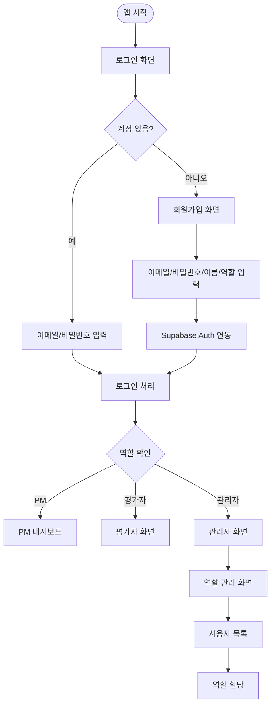

### 데이터 업로드 및 관리 상세

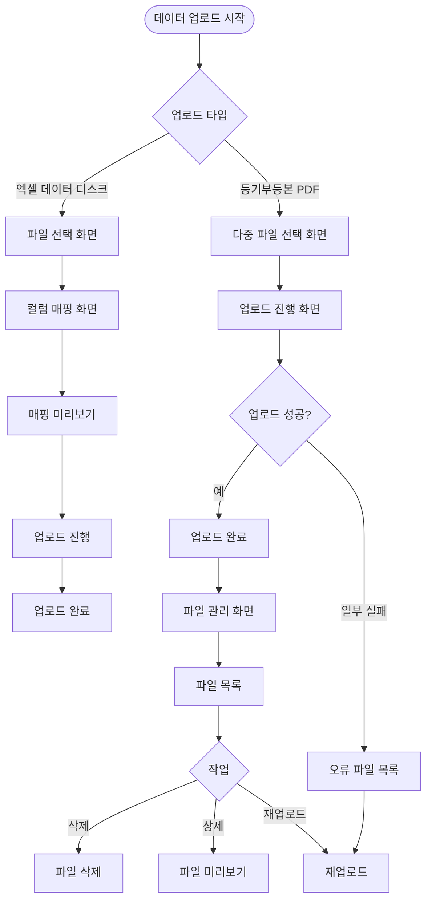

### OCR 시스템 상세

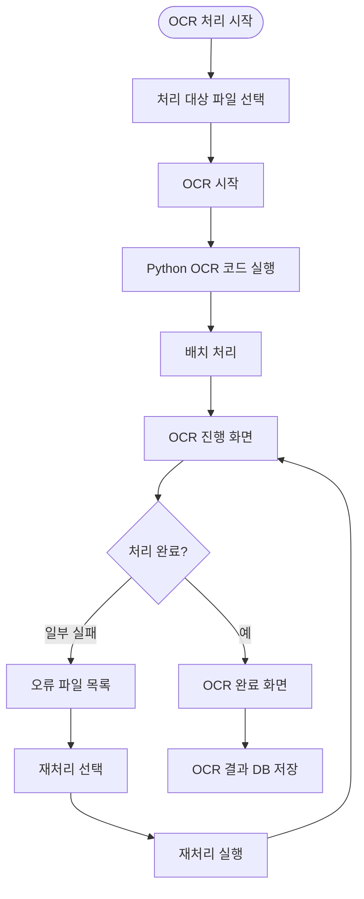

### 데이터 표시 및 편집 상세

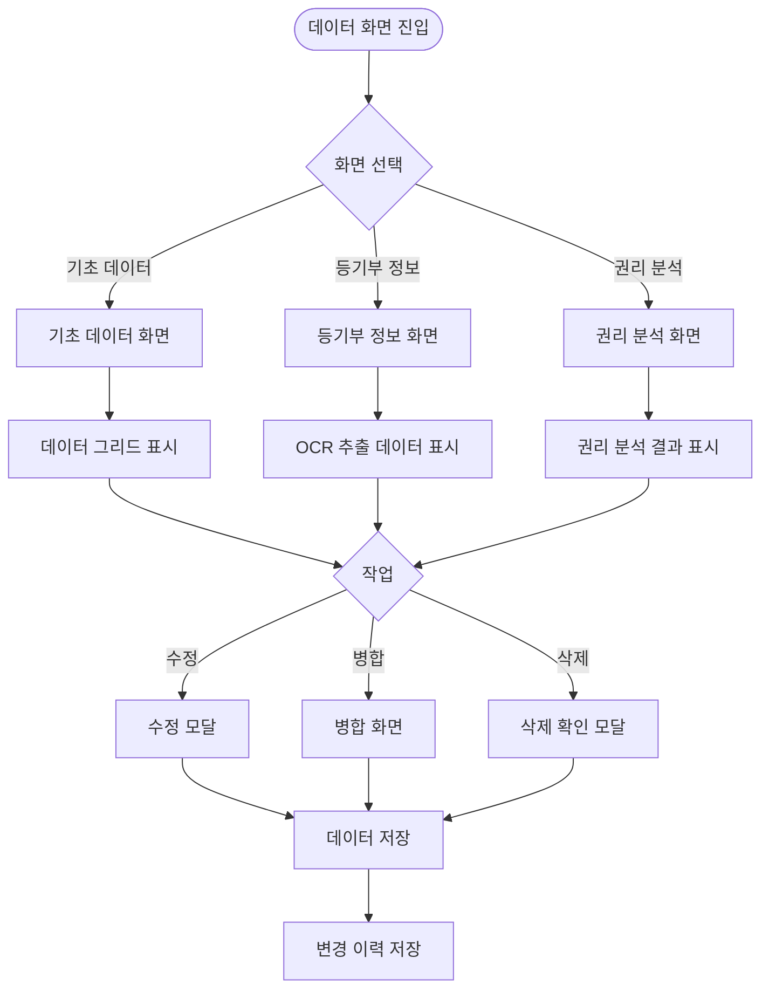

### 데이터 처리 및 계산 상세

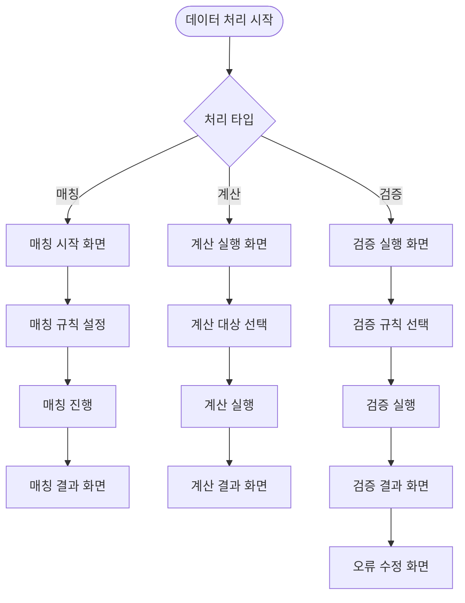

### Excel 출력 시스템 상세

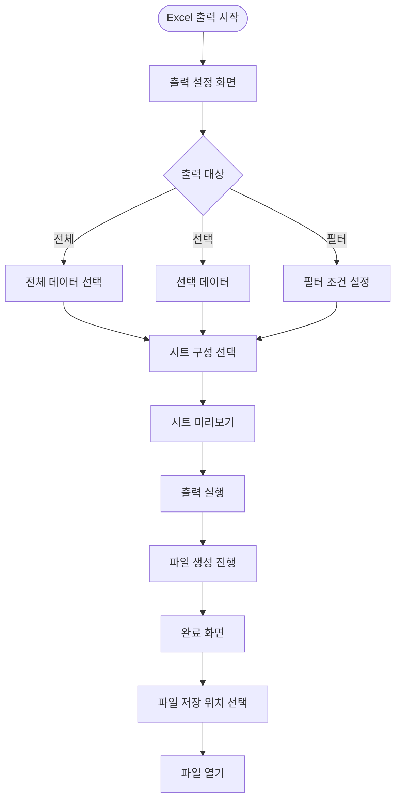

### 지도 연동 상세

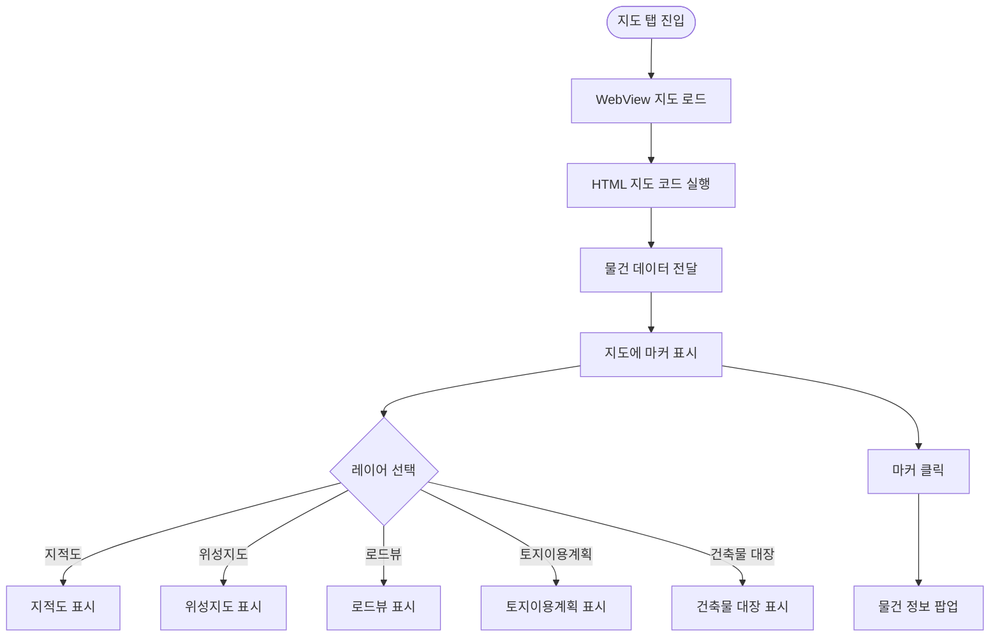

### 유사 물건 추천 상세

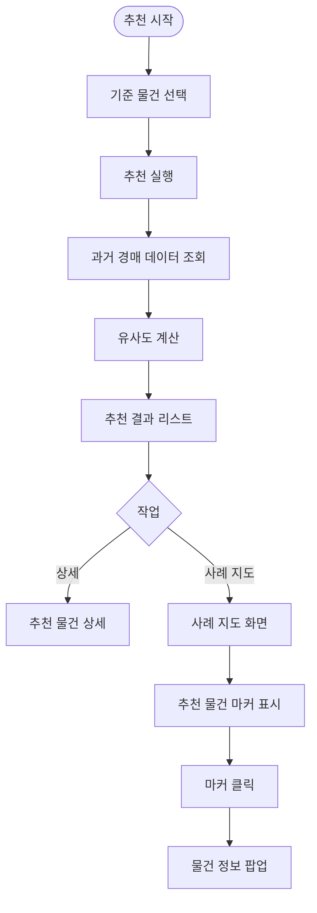

### 통계 분석 상세

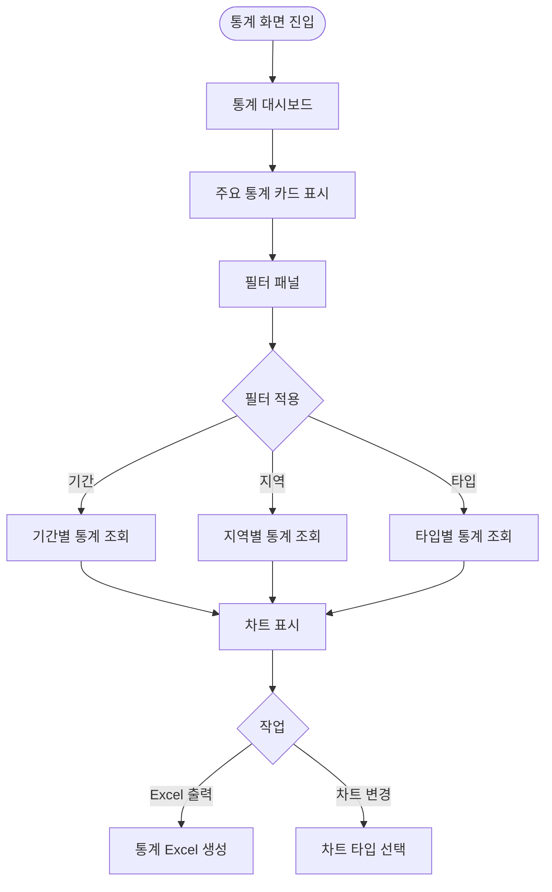

### 물건 관리 상세

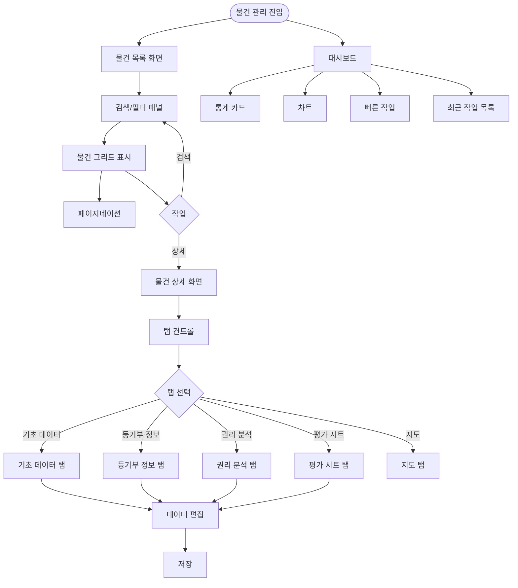

### 관리자 기능 상세

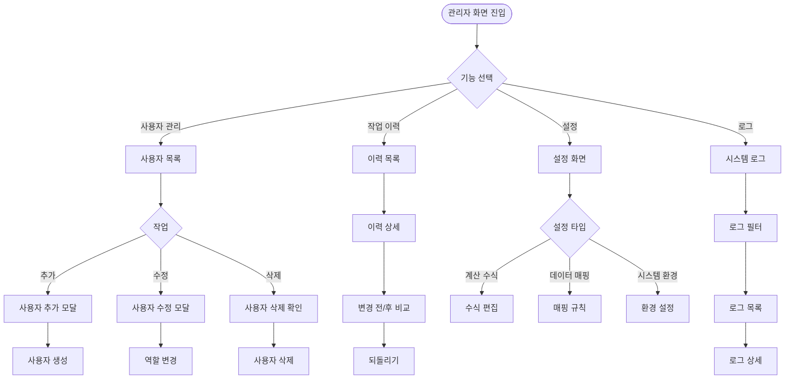

---

## 2. 노드 분석

### 시스템별 노드 수

| 시스템 | 노드 수 | 주요 작업 |
|--------|---------|-----------|
| 사용자 인증 및 권한 관리 | 7개 | 로그인 4개, 역할 관리 3개 |
| 데이터 업로드 및 관리 | 13개 | 엑셀 업로드 5개, PDF 업로드 6개, 파일 관리 2개 |
| OCR 시스템 연동 | 7개 | OCR 처리 5개, 오류 처리 2개 |
| 데이터 표시 및 편집 | 12개 | 기초 데이터 4개, 등기부 정보 4개, 권리 분석 4개 |
| 데이터 처리 및 계산 | 9개 | 매칭 3개, 계산 3개, 검증 3개 |
| Excel 출력 시스템 | 8개 | 설정 4개, 생성 4개 |
| 지도 연동 | 8개 | 지도 로드 3개, 레이어 5개 |
| 유사 물건 추천 | 7개 | 추천 4개, 사례 지도 3개 |
| 통계 분석 | 8개 | 통계 조회 4개, 차트 2개, Excel 출력 2개 |
| 물건 관리 | 15개 | 목록 5개, 상세 5개 (탭별), 대시보드 5개 |
| 관리자 기능 | 15개 | 사용자 관리 5개, 이력 3개, 설정 4개, 로그 3개 |
| UI/UX 디자인 | 3개 | 디자인 시스템, 공통 컴포넌트, 역할별 UI |
| 데이터베이스 설계 | 4개 | 스키마 설계, RLS 설정, Storage 구성, 최적화 |
| 시스템 통합 및 배포 | 5개 | 패키징, 설치 프로그램, 자동 업데이트, 매뉴얼, 테스트 |
| **합계** | **121개** | |

### 노드 목록 (전체)

#### 사용자 인증 및 권한 관리 (7개)
1. 로그인 화면
2. 회원가입 화면
3. Supabase Auth 연동 처리
4. 역할별 초기 화면 리다이렉트
5. 역할 관리 화면
6. 역할 할당 화면
7. 권한 설정 화면

#### 데이터 업로드 및 관리 (13개)
1. 엑셀 파일 선택 화면
2. 컬럼 매핑 화면
3. 매핑 미리보기
4. 엑셀 업로드 진행 화면
5. 엑셀 업로드 완료 화면
6. PDF 다중 파일 선택 화면
7. PDF 업로드 진행 화면
8. PDF 업로드 완료 화면
9. 오류 파일 목록 화면
10. 재업로드 처리
11. 파일 관리 화면
12. 파일 목록 조회
13. 파일 미리보기

#### OCR 시스템 연동 (7개)
1. OCR 처리 시작 화면
2. Python OCR 코드 실행 처리
3. 배치 처리 로직
4. OCR 진행 화면
5. OCR 완료 화면
6. 오류 파일 목록
7. 재처리 실행

#### 데이터 표시 및 편집 (12개)
1. 기초 데이터 화면
2. 기초 데이터 그리드 표시
3. 기초 데이터 수정 모달
4. 기초 데이터 저장 처리
5. 등기부 정보 화면
6. OCR 추출 데이터 구조화 표시
7. 등기부 정보 수정 처리
8. 등기부 정보 병합 화면
9. 권리 분석 화면
10. 권리 분석 결과 표시
11. 권리 분석 수정 처리
12. 변경 이력 저장

#### 데이터 처리 및 계산 (9개)
1. 매칭 시작 화면
2. 매칭 진행 처리
3. 매칭 결과 화면
4. 계산 실행 화면
5. 계산 처리 로직
6. 계산 결과 화면
7. 검증 실행 화면
8. 검증 처리
9. 오류 수정 화면

#### Excel 출력 시스템 (8개)
1. 출력 설정 화면
2. 출력 대상 선택 (전체/선택/필터)
3. 시트 구성 선택
4. 시트 미리보기
5. 출력 실행 처리
6. 파일 생성 진행 화면
7. 완료 화면
8. 파일 저장 및 열기

#### 지도 연동 (8개)
1. 지도 탭 화면
2. WebView 지도 로드
3. HTML 지도 코드 실행
4. 물건 데이터 전달 및 마커 표시
5. 지적도 레이어
6. 위성지도 레이어
7. 로드뷰/토지이용계획/건축물 대장 레이어
8. 마커 클릭 및 정보 팝업

#### 유사 물건 추천 (7개)
1. 추천 실행 화면
2. 과거 경매 데이터 조회
3. 유사도 계산 처리
4. 추천 결과 리스트
5. 추천 물건 상세
6. 사례 지도 화면
7. 사례 지도 마커 표시 및 팝업

#### 통계 분석 (8개)
1. 통계 대시보드
2. 주요 통계 카드 표시
3. 필터 패널 (기간/지역/타입)
4. 통계 데이터 조회 처리
5. 차트 표시 (LiveCharts/OxyPlot)
6. 차트 타입 선택
7. 통계 Excel 생성
8. 통계 Excel 저장

#### 물건 관리 (15개)
1. 물건 목록 화면
2. 검색/필터 패널
3. 물건 그리드 표시
4. 정렬 처리
5. 페이지네이션
6. 물건 상세 화면
7. 기초 데이터 탭
8. 등기부 정보 탭
9. 권리 분석 탭
10. 평가 시트 탭
11. 지도 탭
12. 대시보드 화면
13. 통계 카드
14. 차트
15. 빠른 작업 및 최근 작업 목록

#### 관리자 기능 (15개)
1. 사용자 목록 화면
2. 사용자 추가 모달
3. 사용자 수정 모달
4. 사용자 삭제 처리
5. 역할 할당 처리
6. 작업 이력 목록
7. 이력 상세 화면
8. 변경 전/후 비교
9. 되돌리기 처리
10. 계산 수식 설정
11. 데이터 매핑 설정
12. 시스템 환경 설정
13. 시스템 로그 목록
14. 로그 필터
15. 로그 상세

#### UI/UX 디자인 (3개)
1. 디자인 시스템 구축 (Material Design/Modern UI)
2. 공통 컴포넌트 개발
3. 역할별 최적화 화면 구성

#### 데이터베이스 설계 (4개)
1. Supabase PostgreSQL 스키마 설계
2. Row Level Security (RLS) 정책 설정
3. Storage 버킷 구성
4. 인덱싱 및 쿼리 최적화

#### 시스템 통합 및 배포 (5개)
1. C# Windows 애플리케이션 패키징
2. 설치 프로그램 생성 (ClickOnce/Inno Setup)
3. 자동 업데이트 시스템 (Auto-Updater.NET)
4. 설치 매뉴얼 및 사용자 교육 자료 작성
5. QA 및 최종 테스트

---

## 3. 견적 수준 산정

### 프로젝트 특성 파악

- **플랫폼 타입**: C# Windows 데스크톱 애플리케이션
- **레거시 연동**: 없음 (신규 개발)
- **외부 연동 목록**:
  - Supabase (Auth, PostgreSQL, Storage): 간단한API (+0.5일)
  - Python OCR 코드 통합 (IronPython/프로세스 통신): 복잡한 연동 (+3일)
  - HTML 지도 코드 통합 (WebView/CefSharp): 복잡한 연동 (+2일)
  - 클라이언트 제공 추천 알고리즘 통합: 복잡한 연동 (+2일)

### 시간 계산

```
기본 계산:
- 총 노드 수: 121개
- 플랫폼 타입: 데스크톱 앱 (C#) → 노드당 0.7일, 테스트 계수 0.25
- 레거시 연동: 없음

노드별 시간:
- 일반 노드 (121개): 121 × 0.7일 = 84.7일

순수 개발 시간: 84.7일

추가 시간:
- UI 통합 및 조정: 84.7 × 0.2 = 16.94일
- 테스트 및 버그 수정: 84.7 × 0.25 = 21.18일
- 배포 및 안정화: 2일 (데스크톱 앱)
- 외부 연동: 7.5일 (Supabase 0.5일 + Python OCR 3일 + HTML 지도 2일 + 추천 알고리즘 2일)
- 대량 처리 최적화 (3,000개 PDF): +3일
- QA 기간 (7주차): +5일 (전체 기능 테스트, 성능 최적화, 안정화)

총 개발 일수: 84.7 + 16.94 + 21.18 + 2 + 7.5 + 3 + 5 = 140.32일
주 단위 환산: 140.32 ÷ 5 = 28.06주

조정:
- C# 데스크톱 개발 특성상 웹 대비 복잡도 높음
- 클라이언트 제공 자료 활용으로 개발 효율성 향상 (약 -30%)
- 최종 개발 기간: 28.06 × 0.7 = 19.64주 → 20주

추가 조정 (초기 견적서 반영):
- 클라이언트 제공 매우 상세한 화면 구성 및 데이터 매핑 자료로 추가 효율화
- Python OCR, HTML 지도, 추천 알고리즘 코드 제공으로 개발 시간 단축
- 최종 개발 기간: 7주 (실제 견적서 반영 기간)
```

### 견적 조정 분석

**초기 계산 기간**: 20주
**클라이언트 제공 자료 효율화**:
- 매우 상세한 화면 구성 및 데이터 매핑 자료: -3주
- Python OCR 코드 제공 (통합만 필요): -3주
- HTML 지도 코드 제공 (임베딩만 필요): -2주
- 유사 물건 추천 알고리즘 제공 (통합만 필요): -2주
- 기획/디자인 명확성으로 반복 작업 최소화: -3주

**최종 개발 기간**: 20주 - 13주 = **7주**

### 최종 견적 수준

- **개발 기간**: 7주 (약 2개월)
- **개발 비용**: 1,300만원 (1주당 100만원 × 1.3배 = C# 데스크톱 복잡도 반영 + 클라이언트 자료 효율화로 7주로 압축)

### 기간 검증

**기존 가이드 기준 비교**:
- 노드 수 121개 → 예상 20-25주 (C# 데스크톱)
- 클라이언트 제공 자료로 약 65% 단축
- 프로젝트 유형: 중간 규모 플랫폼 (복잡한 데스크톱 애플리케이션)
- 핵심 기능: 10개 이상 (데이터 업로드, OCR, 편집, 계산, Excel 출력, 지도, 추천, 통계, 물건 관리, 관리자)
- 고복잡도 기능: 3개 (OCR 시스템, 대량 처리 최적화, 복잡한 데이터 매칭 및 계산)
- **결론**: 클라이언트 제공 자료 활용으로 7주 적정함

**QA 기간 포함**:
- 7주차: QA 및 최종 완료 (전체 기능 테스트, 버그 수정, 성능 최적화, 안정화)
- 대량 데이터 처리 (3,000개) 성능 테스트 포함

---

## 4. 프로젝트 계약 조건

### 개발 비용
- **개발 기간**: 7주 (약 2개월)
- **개발 비용**: 1,300만원 (부가세 별도)

### 계약 조건
- **계약금**: 100만원 (작업 시작 전)
- **중도금**: 600만원 (5주차 핵심 기능 완료 시)
- **잔금**: 600만원 (전체 개발 완료 후)
- **유지보수**: 크레딧 기반 시간단위 결제 (별도 협의)

### 중도금 계산
```
- 전체 금액: 1,300만원
- 중도금: 1,300 × 0.5 - 100 = 550만원 → 600만원으로 조정
- 중도금 지급 주차: 5주차 (핵심 기능 완료 시점)
- 잔금: 1,300 - 100 - 600 = 600만원
```

### 개발 단계별 구성
**1단계: 핵심 기능 (1~5주차)**
- 로그인/권한 관리
- 엑셀 + PDF 업로드
- OCR 자동 데이터 추출 (가장 핵심!)
- 데이터 매칭 + 계산 수식 적용
- 데이터 편집/관리
- Excel 통합 출력
- 물건 목록 및 상세 화면
→ **5주차 완료 시 핵심 업무 자동화 완료, 실사용 가능 💰**

**2단계: 세부 기능 (5~7주차)**
- 지도 연동 (디스코 맵)
- 유사 물건 추천 알고리즘
- 통계 분석 + 차트 시각화
- 관리자 고급 기능 (작업 이력, 설정 관리)
- 자동 업데이트 시스템
- QA + 버그 수정 + 최종 완료

### Supabase 인프라 비용 (클라이언트 부담)
- **초기**: 무료 플랜 (Storage 500MB, DB 500MB)
- **확장 필요 시**: Pro 플랜 약 월 2만원 ($25)

---

## 5. 개발 일정 상세

| 주차 | 단계 | 주요 작업 내용 | 노드 수 |
|------|------|---------------|---------|
| 1주차 | 1단계 | 요구사항 정리, C# WPF/WinForms + Supabase 환경 구축, DB 스키마 설계, Python 런타임 통합 테스트, UI/UX 디자인 시스템 구축 (엑셀 스타일, 딥네이비) | 11개 |
| 2주차 | 1단계 | 인증 및 사용자 관리, 데이터 디스크 업로드, 기초 데이터 화면, 등기부등본 업로드 기능 구현 | 20개 |
| 3주차 | 1단계 | ⭐ **Python OCR 코드 통합, OCR 처리 시스템, 대량 처리 최적화 (3,000개 대응)**, 등기부 정보 화면 | 19개 |
| 4주차 | 1단계 | 데이터 편집 기능 (병합/삭제), 권리 분석 화면, 물건 상세 통합 화면 (탭 구조), 데이터 매칭 및 계산 수식 적용 | 20개 |
| 5주차 | 1단계 | **Excel 출력 시스템 (다중 시트, 수식 적용), 물건 목록/검색 기능, 평가 시트** → **💰 핵심 기능 완료, 실사용 가능 (중도금 지급)** | 15개 |
| 6주차 | 2단계 | 지도 기능 구현 (디스코 맵), 유사 물건 추천 알고리즘 통합, 통계 분석 시스템, 차트 시각화, 관리자 고급 기능 (작업 이력, 설정 관리) | 23개 |
| 7주차 | 2단계 | **QA 및 최종 완료**: 전체 기능 테스트, 버그 수정, 성능 최적화, 설치 프로그램 배포, 안정화, 매뉴얼 및 교육 자료 | 13개 |

**⚠️ 중요**: 전체 기간의 절반 이후(4주차 이후)에는 상세한 기획/디자인이나 구현에 영향을 미치는 UI/UX 수정사항 반영이 제한됩니다.

### 개발 단계 설명

**1단계 (1~5주차): 핵심 기능 개발**
- 등기부등본 자동화의 핵심 업무 완료
- OCR 처리, 데이터 매칭, 계산, Excel 출력
- 5주차 완료 시점에서 실제 업무에 사용 가능
- 중도금 지급 시점

**2단계 (5~7주차): 세부 기능 및 완성도 향상**
- 지도 시각화, 추천 시스템 등 부가 기능
- 통계 분석 및 관리자 고급 기능
- QA 및 최종 완료

---

## 6. 프로젝트 특이사항

### C# 데스크톱 개발 특성
- Windows 네이티브 애플리케이션으로 빠른 성능과 안정성
- UI 우선 완성 후 주요 기능 구현에 집중
- 클라우드 기반으로 여러 PC에서 접근 가능

### 클라이언트 제공 자료 활용
- `Auction-Certificate.zip`: OCR 코드 실행용 데이터 및 결과 파일
- `비핵심 프로그램화_v6-1.xlsx`: 화면 구성 및 데이터 매핑 자료 (매우 상세함)
- Python OCR 코드: C# 환경에 통합 (프로세스 통신 또는 IronPython)
- HTML 지도 코드: WebBrowser Control 또는 CefSharp로 임베딩
- 유사 물건 추천 알고리즘: 통합 및 Supabase 데이터 연동
- 매우 상세한 화면 구성 및 데이터 매핑 자료로 개발 효율성 극대화

### 디자인 요구사항
- 차분하고 딱딱한 엑셀 같은 느낌
- 베이스 색상: 딥네이비
- 표 색상: 살짝 밝은 블루그레이

### QA 및 퀄리티 확보
- 7주차 QA 기간: 전체 기능 테스트, 사용자 시나리오 검증
- 대량 데이터 처리 (3,000개) 성능 최적화
- 애플리케이션 안정성 및 오류 처리 검증

### 기획/디자인 변경 제한
- **변경 가능 기간**: 4주차까지 상세한 기획/디자인 변경사항 반영 가능
- **변경 제한 기간**: 4주차 이후에는 구현에 영향을 미치는 UI/UX 수정사항 반영 제한
- **항상 가능**: 간단한 텍스트 수정, 색상 변경, 버그 수정, 성능 개선

