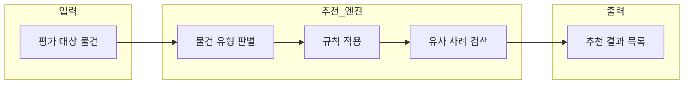
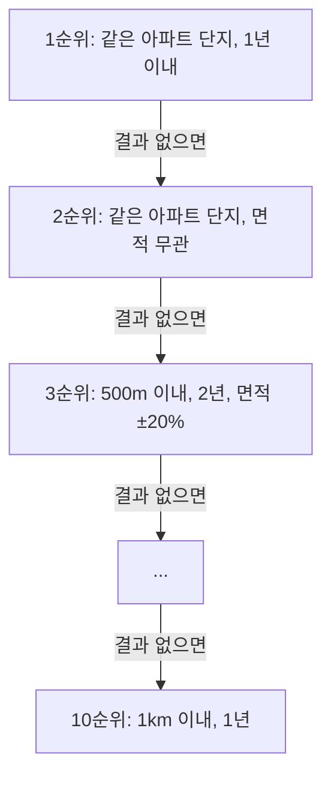
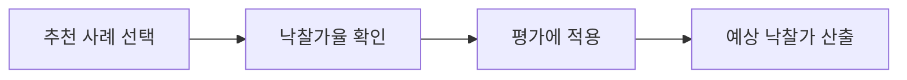
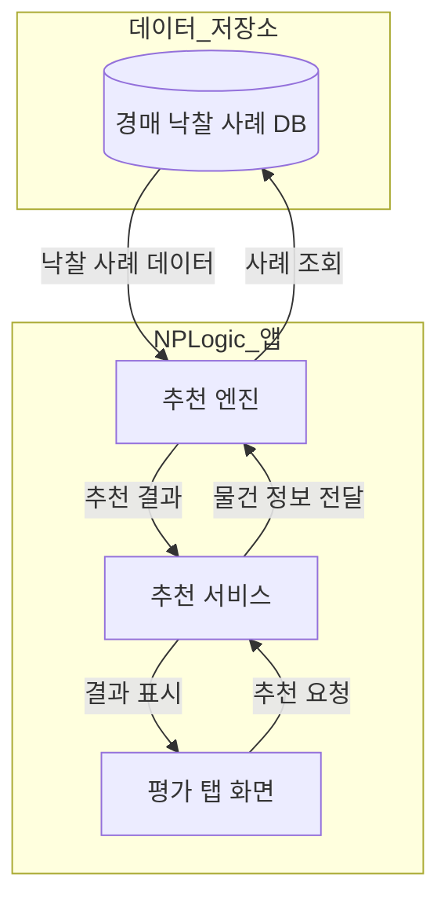

# 유사물건 추천 시스템

## 개요

경매 낙찰 사례 데이터를 활용하여, 평가 대상 물건과 유사한 과거 낙찰 사례를 자동으로 찾아주는 시스템입니다.

---

## 작동 방식

### 1단계: 물건 유형 판별

평가 대상 물건의 **용도**를 보고 5가지 유형 중 하나로 분류합니다.

| 유형 | 포함 물건 |
|------|----------|
| 아파트/오피스텔 | 아파트, 오피스텔 |
| 연립/다세대 | 연립주택, 다세대주택, 빌라 |
| 상가/사무실 | 근린상가, 사무실, 아파트형공장 |
| 공장/창고 | 공장, 창고, 주유소 등 |
| 기타 | 주택, 토지, 근린시설 등 |

### 2단계: 규칙 적용

유형별로 **1순위 ~ 10순위**까지 단계적인 검색 규칙이 적용됩니다.

**규칙 조건 예시 (아파트 1순위):**
- 같은 아파트 단지
- 낙찰일 기준 1년 이내
- 건물 면적 ±20% 이내

### 3단계: 결과 정렬

찾아낸 유사 사례를 **최신순 + 가까운 거리순**으로 정렬하여 최대 10건을 반환합니다.

---

## 추천 결과 활용

1. 추천된 유사 사례 목록에서 적합한 사례 선택
2. 해당 사례의 **낙찰가율** (낙찰가 ÷ 감정가) 확인
3. **[사례 적용]** 버튼으로 현재 평가에 반영
4. 평가 대상 물건의 예상 낙찰가 자동 계산

---

## 데이터 흐름

---

## 요약

| 항목 | 내용 |
|------|------|
| **목적** | 평가 대상과 유사한 과거 낙찰 사례 자동 추천 |
| **분류 기준** | 물건 용도 (아파트, 상가, 공장 등) |
| **검색 조건** | 거리, 기간, 면적, 단가 등 |
| **결과** | 최대 10건의 유사 사례 (낙찰가율 포함) |
| **활용** | 선택한 사례의 낙찰가율을 평가에 적용 |

